# Kilo Code OTel GenAI Instrumentation Plan

Reference implementation in TypeScript / VS Code extension context for two
OTel GenAI semantic-convention proposals authored by @KazChe:

- [open-telemetry/semantic-conventions#3661](https://github.com/open-telemetry/semantic-conventions/issues/3661)
  Generic Grouping Attributes for Agentic Workflow Spans
- [open-telemetry/semantic-conventions#3662](https://github.com/open-telemetry/semantic-conventions/issues/3662)
  Causal Span Linking for LLM-Triggered Tool Execution

Companion to the Python framework integration tests at
[KazChe/otel-genai-semconv-grouping-causality-prototype](https://github.com/KazChe/otel-genai-semconv-grouping-causality-prototype).
Kilo Code adds a TypeScript / single-process / IDE-extension reference point
that the Python prototype repo does not cover.

## Goals

1. Demonstrate the causality proposal by emitting `execute_tool` spans whose
   parent context comes from the specific LLM stream that triggered them, not
   from the wrapping `streamText` call.
2. Demonstrate the grouping proposal by setting W3C Baggage at the agent-loop
   boundary so `gen_ai.group.id` and `gen_ai.group.iteration.type` propagate
   to all downstream spans.
3. Stay vendor-neutral: emit standard OTel via OTLP so any backend (Phoenix,
   Arize, Galileo, Jaeger, Tempo) can ingest, filter, and group.

## Instrumentation roles and proposal alignment

The OTel GenAI proposals
([#3661](https://github.com/open-telemetry/semantic-conventions/issues/3661)
grouping,
[#3662](https://github.com/open-telemetry/semantic-conventions/issues/3662)
causality) are addressed to **instrumentation authors**. In Kilo's runtime
three instrumentation surfaces meet, and only one of them is in our control:

| Surface | Instrumentation author | Implements the proposal? |
|---|---|---|
| AI SDK spans (`ai.streamText`, `ai.streamText.doStream`, `ai.toolCall`) | Vercel | No (not aware of the proposals) |
| Effect.fn spans (`SessionPrompt.run`, etc.) | Effect / `@effect/opentelemetry` | No (not aware) |
| Kilo's tool framework (the `execute_tool` span we add in commit 10) | **Us, this prototype** | Yes |

### Dual role we play

The proposal's "ideal" causality flow expects **the LLM library's
instrumentation author to capture trace context at tool-call emission** and
pass it downstream (via a native sidecar where one exists, or out-of-band
keyed by `tool_call_id` where one doesn't). Vercel AI SDK does not do this
today. The upstream cooperation the proposal assumes is missing.

In Kilo we play **both roles**:

1. **Stand in for Vercel AI SDK** by capturing trace context at the consumer
   site ([`session/processor.ts` `case "tool-call":`](packages/opencode/src/session/processor.ts#L298)).
   This is the closest point we can reach to where Vercel's instrumentor
   would capture if it were aware of the proposal.
2. **Author Kilo's tool framework instrumentation** by extracting the carrier
   at [`tool/tool.ts`](packages/opencode/src/tool/tool.ts) and emitting the
   `execute_tool` span with the captured context as parent.

### Mapping to the proposal's named patterns

#3662 explicitly handles frameworks without a native sidecar (the Python
prototype's AutoGen, LlamaIndex, CrewAI). The proposal calls this
**out-of-band correlation**: maintain a `tool_call_id`-keyed map populated
by whoever observes the tool call and consumed by whoever executes it.

> "Out-of-Band Correlation is the fallback for frameworks that don't provide
> a native sidecar. It means the carrier doesn't travel inside any framework
> object at all. Instead, the instrumentor stores the carrier in a separate
> data structure, typically a thread-local or async-local dict that is keyed
> by the tool call's correlation ID." — #3662

For Kilo, `processor.ts` plays the exact role of "the instrumentor" in that
passage: it observes the tool-call event and places the carrier in the
`CausalityCarrier` map (commit 6) keyed by `tool_call.id`. This is the same
pattern the Python prototype uses for AutoGen, LlamaIndex, and CrewAI.

### Proposal conformance scorecard

- ✅ `tool_call_id` as the correlation key
- ✅ Out-of-band `Map<toolCallId, Context>` carrier — matches the proposal's
  named fallback for frameworks without a native sidecar
- ⚠️ The captured context is the consumer's Effect.fn frame, not Vercel's
  `ai.streamText.doStream` — this is a feature of Kilo's setup (Vercel AI
  SDK is opaque to us). The Python prototype's tests for AutoGen,
  LlamaIndex, and CrewAI all capture similar consumer-side contexts for the
  same reason: when the upstream LLM library doesn't cooperate, the
  instrumentor's natural point of observation is the consumer.
- ✅ Extract at the tool framework boundary (`tool/tool.ts`)
- ✅ Parent-child causal tree in the rendered trace

The prototype demonstrates the pattern is implementable end-to-end. In a
fully conformant world Vercel AI SDK would do the capture; `processor.ts`
would not need to. **The pattern works either way; the capture site is
implementation detail.** This is a meaningful complement to the Python
prototype, because it adds a TypeScript / single-process / IDE-extension /
non-Python-agent-framework data point to the same proposal pattern.

## Non-goals (v0)

- Skill detection. Kilo's skills are markdown content the model reads, not
  runtime-orchestrated entities. `gen_ai.group.skill.id` and
  `gen_ai.group.skill.type` are not emitted by Kilo. The grouping proposal
  explicitly allows absent dimensions.
- Span-link-based causality. The causality proposal explicitly argues against
  span links as the recovery mechanism. Parent-child only.
- Re-parenting Vercel AI SDK's existing `ai.toolCall` spans. We layer our
  `execute_tool` span on top and accept span duplication for v0. Reversible.
- Replacing PostHog export. The existing PostHog flow stays. OTLP is added as
  a parallel exporter, opt-in via config.

## Decisions

| Decision | Choice | Notes |
|---|---|---|
| `gen_ai.group.id` semantics | Per-step (Interpretation A) | Matches the proposal's own example (`round-2`). Session identity carried by existing `gen_ai.conversation.id`. |
| `gen_ai.group.iteration.type` value | Both `gen_ai.agent.id` (Kilo agent name, literal) and `gen_ai.group.iteration.type` (generalized taxonomy) | Option (c). Lets backends filter on either. |
| Iteration boundary | One pass through the `while` body in [`SessionPrompt.run`](packages/opencode/src/session/prompt.ts#L1340) — equivalently, one call to `LLM.run` (where the baggage is actually set; see Decisions row on `withBaggage` below). Indexed by a per-`sessionID` monotonic counter (`STEP_COUNTERS` map in [`session/llm.ts`](packages/opencode/src/session/llm.ts)). | Each pass is one LLM round-trip plus its tool executions. The runLoop's local `step` integer at [prompt.ts:1349](packages/opencode/src/session/prompt.ts#L1349) is logically equivalent but not what we use to label spans. |
| Span links | Not used | Per #3662 stated stance. |
| Vercel AI SDK tool spans | Layer our `execute_tool` span on top, accept duplication | Reversible; revisit after v0. |
| OTLP export | Opt-in via config flag | Default off; existing PostHog flow unchanged. |
| OTLP config shape | `experimental.otlp_export.{enabled, endpoint, headers, record_content}` (snake_case) | Matches existing `experimental.*` snake_case convention. The pre-existing `openTelemetry` field is the only camelCase outlier. Internal TS function signatures use camelCase (`otlpExport`, `recordContent`) with explicit field mapping at the [`opencode/src/index.ts`](packages/opencode/src/index.ts) bridge. |
| OTLP misconfiguration | `enabled=true` with missing `endpoint` → `console.warn` and skip OTLP setup | Graceful degradation. PostHog flow unaffected; no crash. |
| OTLP processor | `BatchSpanProcessor` wrapping `OTLPTraceExporter` from `@opentelemetry/exporter-trace-otlp-proto` (protobuf encoding) | PostHog stays on `SimpleSpanProcessor` (small, sync flush). OTLP needs batching for network efficiency. Default batch params (queue 2048, delay 5s) are fine for v0. **Originally used `-http` (JSON), but Arize Phoenix and several other OTLP receivers reject `application/json` at `/v1/traces` with 415 Unsupported Media Type. Switched to `-proto` after empirical confirmation.** |
| Span processor order | `[BaggageSpanProcessor, SimpleSpanProcessor (PostHog), BatchSpanProcessor (OTLP, when enabled)]` | BaggageSpanProcessor MUST be first so baggage is copied onto span attributes before any exporter sees the span. Both exporters then receive the same enriched spans. |
| Carrier mechanism | In-memory `Map<toolCallId, Context>` | Single-process, no cross-framework serialization needed. Stores full OTel `Context` (not just `SpanContext`) so baggage at capture time is preserved when extracted as parent context for the `execute_tool` span. |
| Helper module split | `CausalityCarrier` lives in `packages/kilo-telemetry/src/causality-carrier.ts` (pure OTel, no Effect dep). `withBaggage` lives in `packages/opencode/src/effect/otel-baggage.ts` (Effect-aware, depends on `effect` package). | Keeps kilo-telemetry decoupled from the Effect runtime so it stays usable as a pure OTel module. The Effect-aware bridge lives where Effect is already a dependency. |
| `withBaggage` signature | `<A, E>` (R = never; caller pre-resolves dependencies) | Tried Effect 3's `Effect.runtime<R>()` / `Runtime.runPromise(rt)(eff)` pattern: those APIs do not exist in Effect 4. Tried Effect 4's `Effect.callback<A, E, R>` with `resume(eff)` to delegate execution to the runtime: that approach typechecks but **does not propagate AsyncLocalStorage** at the resume call site, so the inner Effect runs in the outer OTel context, not the new one. Only `Effect.runPromise(eff).then(...)` propagates correctly (because `runPromise` returns a real Promise whose microtask captures AsyncLocalStorage at `.then` registration time). `runPromise` requires R = never, so the helper signature is constrained accordingly. **Note:** the original plan was to use this helper for turn-level baggage at [`session/prompt.ts:1971`](packages/opencode/src/session/prompt.ts#L1971). Empirically that wrapper turned out to be bypassed by all production paths (extension/CLI/TUI go SDK→server→`svc.prompt(...)` directly). Production baggage now lands at [`LLM.run`](packages/opencode/src/session/llm.ts) immediately before `streamText({...})` using `context.with(setBaggage(...), ...)` directly (no helper needed at this site, because we wrap a synchronous call rather than an Effect). The `withBaggage` helper remains useful for any future direct programmatic Session.prompt(input) caller, and is retained as defense-in-depth. |

## Architecture (validated)

This section captures findings discovered while reading the codebase post-pull
(652 commits since initial recon). Two of these change how the implementation
should land. Both are reflected in the commit table below.

### Two TracerProviders coexist

Kilo runs **two independent OTel TracerProviders**, linked by a shared global
context manager. Spans flow to different exporters depending on origin.

| Provider | Source | Spans produced | Exporter |
|---|---|---|---|
| `@effect/opentelemetry/NodeSdk` | [packages/opencode/src/effect/observability.ts:70-95](packages/opencode/src/effect/observability.ts#L70-L95) | All `Effect.fn` spans (Session.create, SessionPrompt.prompt, SessionPrompt.run, …) | OTLP (when `OTEL_EXPORTER_OTLP_ENDPOINT` env var set) |
| `NodeTracerProvider` from kilo-telemetry | [packages/kilo-telemetry/src/tracer.ts](packages/kilo-telemetry/src/tracer.ts) | Vercel AI SDK spans (`ai.streamText`, `ai.toolCall`, …) and our future `execute_tool` spans | PostHog (with content filtering) |

Critically, [observability.ts:75-85](packages/opencode/src/effect/observability.ts#L75-L85)
explicitly registers an `AsyncLocalStorageContextManager` as the global OTel
context manager. Without it, AI SDK spans would not see Effect spans as
parents and every AI SDK span would start a new trace. With it, both
providers' spans share trace IDs and form a unified logical tree, even though
each provider exports through a different pipeline.

### Implication for our OTLP work

The OTLP path already exists for Effect spans, gated by env var. **What's
missing is OTLP for the kilo-telemetry side**: AI SDK spans + our future
`execute_tool` spans currently flow only to PostHog.

The fix: add OTLP as a second exporter on kilo-telemetry's `NodeTracerProvider`
(alongside the existing PostHog exporter). This keeps PostHog unchanged and
adds OTLP as a parallel destination for the same spans. Spans from both
providers end up at the same OTLP endpoint, with shared trace IDs from the
global context manager, where they reassemble into a single trace tree.

### Q1 (Effect ↔ OTel context propagation): ANSWERED

Validated empirically by [packages/opencode/test/effect/otel-baggage-propagation.test.ts](packages/opencode/test/effect/otel-baggage-propagation.test.ts)
(8/8 tests pass). Findings:

1. OTel baggage propagates correctly through `Effect.gen` yields,
   `Effect.fn` spans, `Effect.promise`, `Effect.sleep`, and global tracer
   span creation. The substrate works.
2. Setting baggage from inside an Effect requires a small helper. The
   validated shape:

```ts
function withBaggage<A, E>(
  values: Record<string, string>,
  eff: Effect.Effect<A, E>,
): Effect.Effect<A, E> {
  return Effect.callback<A, E>((resume) => {
    const previousContext = context.active()
    const existing = propagation.getBaggage(previousContext) ?? propagation.createBaggage()
    let merged = existing
    for (const [key, value] of Object.entries(values)) {
      merged = merged.setEntry(key, { value })
    }
    const newContext = propagation.setBaggage(previousContext, merged)
    context.with(newContext, () => {
      Effect.runPromise(eff).then(
        (v) => context.with(previousContext, () => resume(Effect.succeed(v))),
        (e) => context.with(previousContext, () => resume(Effect.die(e))),
      )
    })
  })
}
```

Two properties this helper guarantees and that production code depends on:

- **Merge** new entries with existing baggage. Without merge, setting
  step-level `gen_ai.group.id` would clobber turn-level
  `gen_ai.conversation.id`, `gen_ai.agent.id`, `gen_ai.group.iteration.type`.
- **Restore** outer context on resume. Without restore, inner-scope baggage
  leaks back to outer code that runs after the inner Effect completes.

This helper will be extracted into a shared module (likely
`packages/kilo-telemetry/src/baggage.ts` or similar) when we wire up turn-level
and step-level baggage in commits 7 and 8.

## Span hierarchy: before and after

### Before (current state)

```
Effect.fn spans (existing): Session.touch, SessionPrompt.prompt, SessionPrompt.run, ...
└─ ai.streamText (Vercel AI SDK)
   ├─ ai.streamText.doStream  (round 1: model returns tool_call read)
   ├─ ai.toolCall read         ← sibling of doStream, no causal link to round 1
   ├─ ai.streamText.doStream  (round 2: model returns tool_call edit)
   ├─ ai.toolCall edit         ← sibling, no causal link to round 2
   └─ ai.streamText.doStream  (round 3: final answer)
```

Tool execution spans are flat siblings under `ai.streamText`. Reconstructing
which LLM call triggered which tool requires timestamp matching.

### After (target state)

```
SessionPrompt.prompt span                                gen_ai.conversation.id, gen_ai.agent.id,
                                                          gen_ai.group.iteration.type
└─ SessionPrompt.run span                                + (same baggage)
   ├─ step 1                                             gen_ai.group.id = "<sessionID>:step-1"
   │  └─ ai.streamText
   │     ├─ ai.streamText.doStream
   │     │  └─ execute_tool read     (ours)              gen_ai.tool.name, gen_ai.tool.call.id,
   │     │                                                gen_ai.operation.name = execute_tool
   │     └─ ai.toolCall read         (Vercel's, layered)
   ├─ step 2                                             gen_ai.group.id = "<sessionID>:step-2"
   │  └─ ai.streamText
   │     ├─ ai.streamText.doStream
   │     │  └─ execute_tool edit     (ours)
   │     └─ ai.toolCall edit         (Vercel's, layered)
   └─ step 3
      └─ ai.streamText                                   no tool calls; final answer
```

The new `execute_tool` spans are children of the specific `doStream` that
triggered them. Vercel's `ai.toolCall` spans remain where they are; we don't
touch them.

## Attributes emitted

| Attribute | Source | Scope | Value |
|---|---|---|---|
| `gen_ai.conversation.id` | Existing OTel GenAI semconv | Per-turn (set in `SessionPrompt.prompt`) | Kilo `sessionID` |
| `gen_ai.agent.id` | Existing OTel GenAI semconv | Per-turn | Kilo agent name (`code`, `plan`, `explore`, `debug`, `orchestrator`, `ask`) |
| `gen_ai.group.iteration.type` | Proposal #3661 | Per-turn | Generalized taxonomy: `code → code_react`, `plan → plan_execute`, `explore → tool_use`, `debug → debug_react`, `orchestrator → orchestrate`, `ask → ask`. Default `react` if no mapping. |
| `gen_ai.group.id` | Proposal #3661 | Per-step (set inside `while` body) | `"<sessionID>:step-<N>"` for global uniqueness across sessions. Adheres to the proposal (the proposal does not constrain format); the proposal's `round-2` example is illustrative, not normative. |
| `gen_ai.operation.name` | Existing OTel GenAI semconv | Per-tool-execution span | `execute_tool` |
| `gen_ai.tool.name` | Existing OTel GenAI semconv | Per-tool-execution span | The tool ID (`read`, `edit`, `bash`, etc.) |
| `gen_ai.tool.call.id` | Existing OTel GenAI semconv | Per-tool-execution span | The model-assigned tool call ID |
| `gen_ai.tool.call.arguments` | Existing OTel GenAI semconv | Per-tool-execution span (gated by content-capture flag) | Tool arguments as JSON string |
| `gen_ai.tool.call.result` | Existing OTel GenAI semconv | Per-tool-execution span (gated by content-capture flag) | Tool result string |

Skill attributes (`gen_ai.group.skill.id`, `gen_ai.group.skill.type`) are
intentionally absent. See "Non-goals."

## Instrumentation points

Five sites change. File:line references are current as of the branch base
commit; verify before editing.

### 1. [`packages/kilo-telemetry/src/tracer.ts`](packages/kilo-telemetry/src/tracer.ts)

**Add `BaggageSpanProcessor`** alongside the existing `SimpleSpanProcessor`
that exports to PostHog. Without this, baggage set in step 4 below does not
propagate to span attributes automatically.

**Add OTLP exporter** behind a config flag. When enabled, attach a second
`SpanProcessor` (`BatchSpanProcessor` recommended for OTLP) to the same
`NodeTracerProvider`. Both PostHog and OTLP receive the same spans; PostHog
keeps content filtering, OTLP optionally includes content per its own flag.

**New config fields** (additive to `experimental.openTelemetry`):

```ts
experimental.otlpExport: {
  enabled: boolean              // default false
  endpoint: string              // OTLP/HTTP endpoint, e.g. http://localhost:4318/v1/traces
  headers?: Record<string, string>  // for backends like Arize, Galileo that need API keys
  recordContent?: boolean       // default false; when true, include prompts/completions/tool args
}
```

The existing PostHog filtering at [otel-exporter.ts:12-32](packages/kilo-telemetry/src/otel-exporter.ts#L12-L32) is unchanged. The
content-capture decision is per-exporter.

### 2. [`packages/kilo-telemetry/src/`](packages/kilo-telemetry/src/) (new file: `causality-map.ts`)

**Module-level `Map<toolCallId, SpanContext>`** with insert and read APIs.
Lifecycle: insert at carrier-capture point (step 5), read at extract point
(step 4), delete after extract to bound memory. Keys are tool call IDs which
are short-lived (one round of an agent loop), so the map stays small. No
need for periodic cleanup if reads always delete.

```ts
export namespace CausalityCarrier {
  export function capture(toolCallId: string, ctx: SpanContext): void
  export function extract(toolCallId: string): SpanContext | undefined  // also deletes
  export function clear(): void  // for testing
}
```

### 3. [`packages/opencode/src/session/prompt.ts`](packages/opencode/src/session/prompt.ts) — turn-level baggage

**At entry to `SessionPrompt.prompt`** (around [line 1287](packages/opencode/src/session/prompt.ts#L1287), after looking up
`session`), set baggage:

```ts
const ctx = propagation.setBaggage(context.active(), propagation.createBaggage({
  'gen_ai.conversation.id': { value: input.sessionID },
  'gen_ai.agent.id': { value: input.agent },           // assuming agent is on input
  'gen_ai.group.iteration.type': { value: mapAgentToIterationType(input.agent) },
}))
context.with(ctx, () => /* rest of prompt */)
```

The exact wiring may need adjustment for Effect's context model; verify that
OTel context set this way propagates across `Effect.gen` yields. See "Open
questions."

### 4. [`packages/opencode/src/session/prompt.ts`](packages/opencode/src/session/prompt.ts) — step-level baggage

**Inside the `while (true)` body in `runLoop`** at [prompt.ts:1352](packages/opencode/src/session/prompt.ts#L1352),
before the model call, update baggage to include the step ID:

```ts
while (true) {
  const stepId = `${sessionID}:step-${step + 1}`  // step is incremented later, +1 for 1-indexed
  const ctx = propagation.setBaggage(context.active(), updatedBaggageWith({
    'gen_ai.group.id': { value: stepId },
  }))
  yield* context.with(ctx, () => /* rest of step */)
  // ... existing body ...
}
```

### 5. [`packages/opencode/src/session/processor.ts`](packages/opencode/src/session/processor.ts) — carrier capture

**At the `case "tool-call":` block** at [processor.ts:298](packages/opencode/src/session/processor.ts#L298), capture
the active span context (which is the `ai.streamText.doStream` span at this
point) keyed by the tool call ID:

```ts
case "tool-call": {
  CausalityCarrier.capture(value.toolCallId, trace.getSpanContext(context.active())!)
  // ... existing logic ...
}
```

This is the critical sidecar correlation point. The `doStream` span is active
when the tool-call event arrives, so its context is what we capture.

### 6. [`packages/opencode/src/tool/tool.ts`](packages/opencode/src/tool/tool.ts) — execute_tool span

**Inside `Tool.wrap` at [tool.ts:83-112](packages/opencode/src/tool/tool.ts#L83-L112)**, wrap the call to
`execute(args, ctx)` in a new span whose parent is the captured carrier:

```ts
toolInfo.execute = (args, ctx) =>
  Effect.gen(function* () {
    const carrier = ctx.callID ? CausalityCarrier.extract(ctx.callID) : undefined
    const parentCtx = carrier ? trace.setSpanContext(context.active(), carrier) : context.active()

    return yield* Effect.tryPromise(() =>
      tracer.startActiveSpan(
        'execute_tool',
        {
          attributes: {
            'gen_ai.operation.name': 'execute_tool',
            'gen_ai.tool.name': id,
            'gen_ai.tool.call.id': ctx.callID,
            // gen_ai.tool.call.arguments: gated on content-capture flag
          },
        },
        parentCtx,
        async (span) => {
          try {
            // existing body: validate args, execute, truncate output
            return await runEffect(/* ... */)
          } finally {
            span.end()
          }
        },
      ),
    )
  })
```

The Effect-OTel boundary needs care here. The actual implementation may need
to use `Effect.acquireRelease` with `tracer.startSpan` + `span.end()` rather
than `startActiveSpan` to fit the Effect generator pattern. Decide during
implementation.

## Open questions

These do not block drafting the plan but must be resolved during
implementation.

### Q1. Does OTel context propagate across Effect.gen yields?

**Status: ANSWERED (yes).** See "Architecture (validated) → Q1" above for the
validated `withBaggage` helper pattern. Original concern preserved below for
historical context.

Effect.fn creates spans via Effect's own tracing integration. OTel's default
context manager uses `AsyncLocalStorage` (Node), which generally survives
async function boundaries. Effect runs generators in its own runtime; need to
verify the runtime preserves AsyncLocalStorage across yields. If not, we
need to use Effect's own context propagation primitives or capture/reattach
manually at boundaries.

**Validation step:** before implementing the full plan, write a small test
that sets baggage in an Effect.gen, yields several times (including across an
await), creates a child span, and verifies the baggage is present on the
child span. If yes, the plan as drafted works. If no, we need a different
mechanism for baggage propagation inside Effect.

**Outcome:** validated by [packages/opencode/test/effect/otel-baggage-propagation.test.ts](packages/opencode/test/effect/otel-baggage-propagation.test.ts),
8/8 tests passing. The substrate works (AsyncLocalStorage survives Effect's
runtime); the production helper requires merge-with-existing-baggage and
restore-outer-context-on-resume semantics, both now baked into the validated
helper shape.

### Q2. Carrier map cleanup if extract is never called

If a tool call ID is captured but the tool never executes (cancelled, error
during dispatch, etc.), the entry leaks. Extract auto-deletes on read but a
captured-and-never-extracted entry persists. Mitigations:

- TTL on entries (timestamp on capture, periodic sweep)
- Per-session map with cleanup on session close
- Bounded map size with LRU eviction

For v0, accept the leak. Tool call IDs are 30+ characters and rare; even
1000 leaked entries is sub-MB. Revisit if real usage shows growth.

### Q3. Effective parent for `execute_tool` when carrier is missing

If `ctx.callID` is undefined or no carrier was captured (race condition,
manually-invoked tool, etc.), the `execute_tool` span needs a fallback
parent. Options:

- (a) Use the currently active context (would make it a child of whatever's
  on the stack, likely the same place Vercel's ai.toolCall span goes)
- (b) Create as a root span (orphaned in the trace tree)
- (c) Skip span creation entirely

Recommend (a). It degrades gracefully: in the worst case, our span ends up in
the same place as Vercel's ai.toolCall span. The tree is still readable.

### Q4. Iteration type mapping for unknown / custom agents

Kilo allows user-defined agents via config. For built-in agents we have a
fixed mapping table. For user-defined: default to `react` (the most common
agentic pattern) and document that users can override via a future config
attribute (out of scope for v0).

### Q5. Does the existing PostHog `recordInputs: false` decision apply to OTLP?

The Vercel AI SDK telemetry config at [llm.ts:417-418](packages/opencode/src/session/llm.ts#L417-L418) hardcodes
`recordInputs: false, recordOutputs: false`. This is a global config: the AI
SDK will or won't include prompts/completions in spans, and that choice is
seen by all attached exporters.

For OTLP-bound traces, users may want content captured (it's their own
backend, their own data). Options:

- (a) Make the AI SDK content flags configurable
- (b) Always include content in spans, let the PostHog exporter strip
  (matches existing PostHog filter pattern)
- (c) Two TracerProviders: one with content for OTLP, one without for PostHog

**Decision:** option (a). Add a config flag `experimental.otlp_export.record_content`
and thread it through to the Vercel AI SDK call. **Default ON** when OTLP
export is enabled, so the user sees full content by default in their own
backend. PostHog keeps its defense-in-depth filter at
[otel-exporter.ts:12-32](packages/kilo-telemetry/src/otel-exporter.ts#L12-L32),
so content present in spans is still stripped before send to PostHog.

**Implementation split:** the schema field `record_content` lands in commit 5
(the OTLP exporter commit) for schema completeness. The actual threading to
the Vercel AI SDK's `experimental_telemetry.recordInputs/recordOutputs` lands
in commit 11. Between those commits, OTLP receives spans but content is
still stripped at the AI SDK boundary, same as PostHog gets today.

## Validation strategy

Before merging any code, validate the design with two micro-experiments:

1. **OTel + Effect baggage propagation test.** ✅ **DONE.**
   [packages/opencode/test/effect/otel-baggage-propagation.test.ts](packages/opencode/test/effect/otel-baggage-propagation.test.ts),
   8/8 passing. Resolves Q1.

2. **Sidecar carrier round-trip test.** A test that simulates a tool call
   ID capture/extract cycle and asserts the parent context resolves
   correctly. Resolves Q2 and Q3 by exercise. (Pending; lands with commit 6
   below.)

After implementation, validate the demo path:

3. **End-to-end trace visual.** ✅ **DONE 2026-04-25.** See "Validation
   results against Phoenix" below.

## Validation results against Phoenix (2026-04-25)

Ran a multi-round multi-tool session via the dev CLI (`bun run dev run "..."`)
against a local Phoenix container (`arizephoenix/phoenix:latest`, ports
6006 UI / 4317 gRPC / 4318 HTTP, with our config pointing OTLP HTTP at
`http://localhost:6006/v1/traces`). One observed turn yielded four LLM
rounds, all sharing one `gen_ai.conversation.id`:

| Step | Agent | Tool calls | Trace shape |
|---|---|---|---|
| `step-1` | `title` (Kilo's hidden auto-title agent) | None | `ai.streamText` → `ai.streamText.doStream` |
| `step-2` | `code` | 1 × bash | `ai.streamText` → `doStream` + `ai.toolCall` → **`execute_tool`** |
| `step-3` | `code` | 1 × bash | same shape as step-2 |
| `step-4` | `code` | None (final response) | `ai.streamText` → `doStream` |

### Trace gallery

Each Vercel `ai.streamText` becomes its own root span (architectural surprise; see below), so the four LLM rounds above produce four separate traces. All four share `gen_ai.conversation.id = ses_23a3695afffesb1aie4rD03xAk`; each carries a unique `gen_ai.group.id`.

**step-1 (auto-title agent, no tools)**

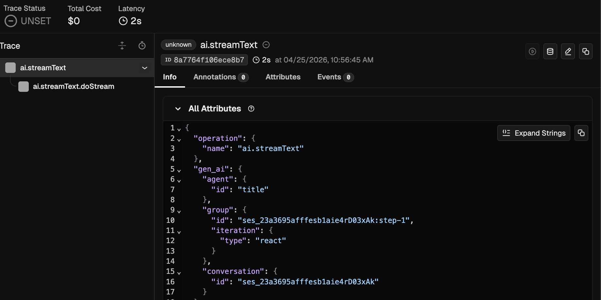

*`ai.streamText` root span. `gen_ai.agent.id: title`, `gen_ai.group.id: …:step-1`, `gen_ai.group.iteration.type: react`. Title agent runs once per turn before the user-visible agent.*

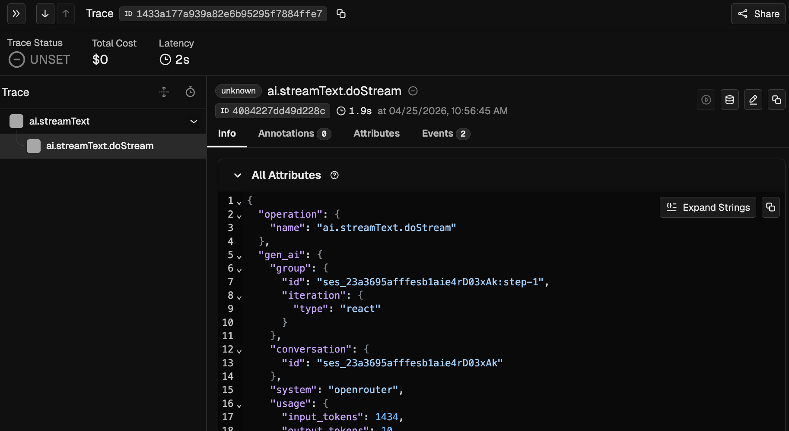

*`doStream` child inherits the same baggage attributes via `BaggageSpanProcessor`.*

**step-2 (code agent, first bash tool round)**

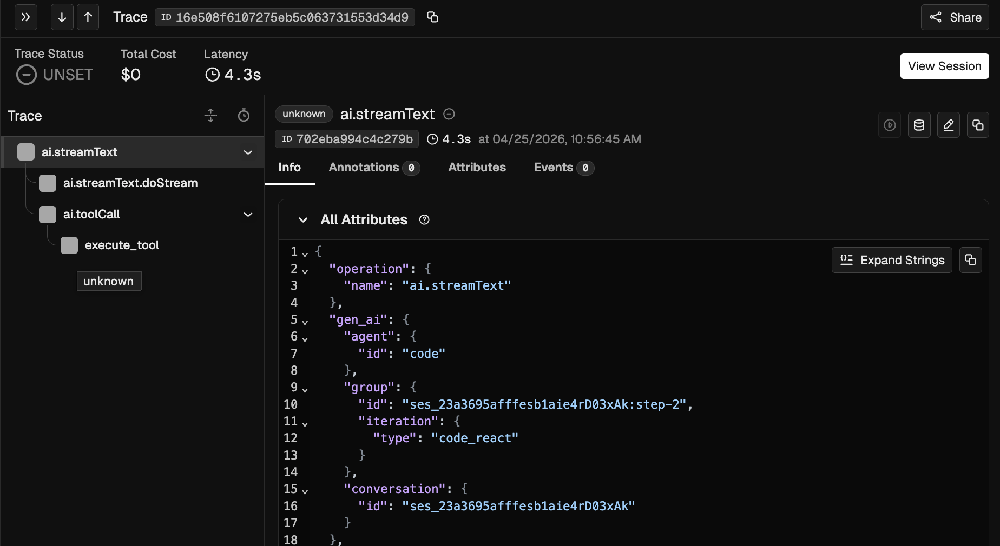

*Full causality tree visible: `ai.streamText` → `ai.streamText.doStream` + `ai.toolCall` → `execute_tool`. `agent.id: code`, `iteration.type: code_react`, `group.id: …:step-2`.*

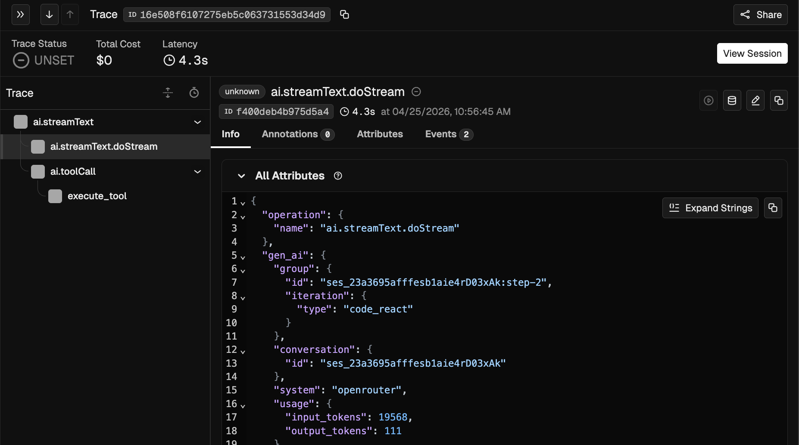

*`doStream` for step-2's LLM round.*

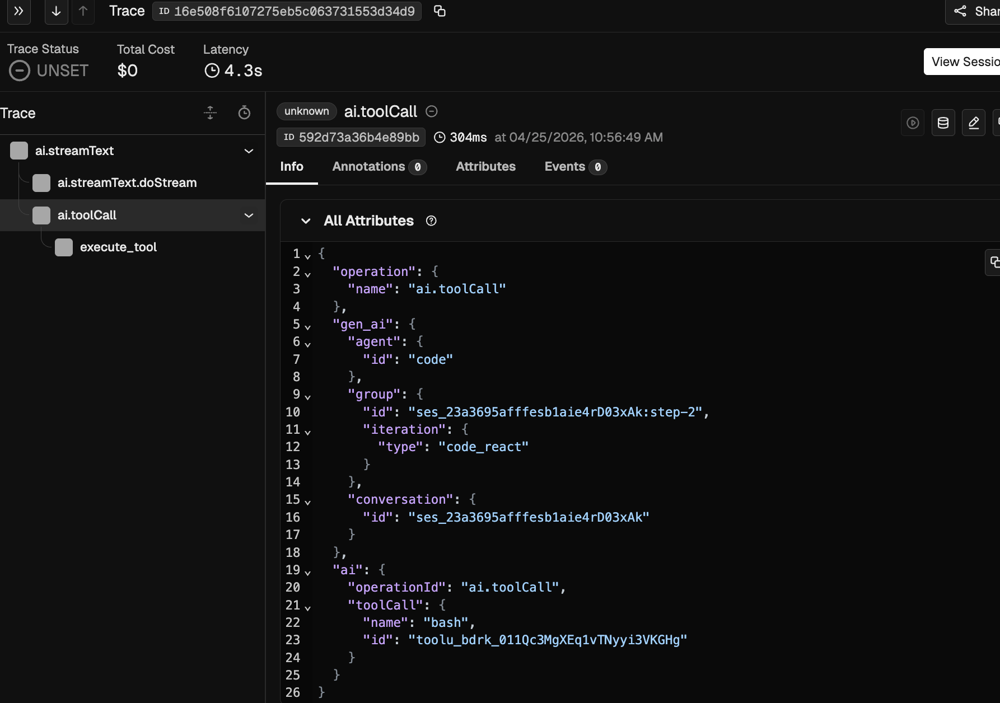

*Vercel's `ai.toolCall` span. `tool_call.id: toolu_bdrk_011Qc3MgXEq1vTNyyi3VKGHg`, `tool.name: bash`. Grouping baggage attributes appear here too because `BaggageSpanProcessor` runs on every span the kilo-telemetry tracer produces, regardless of who originated it.*

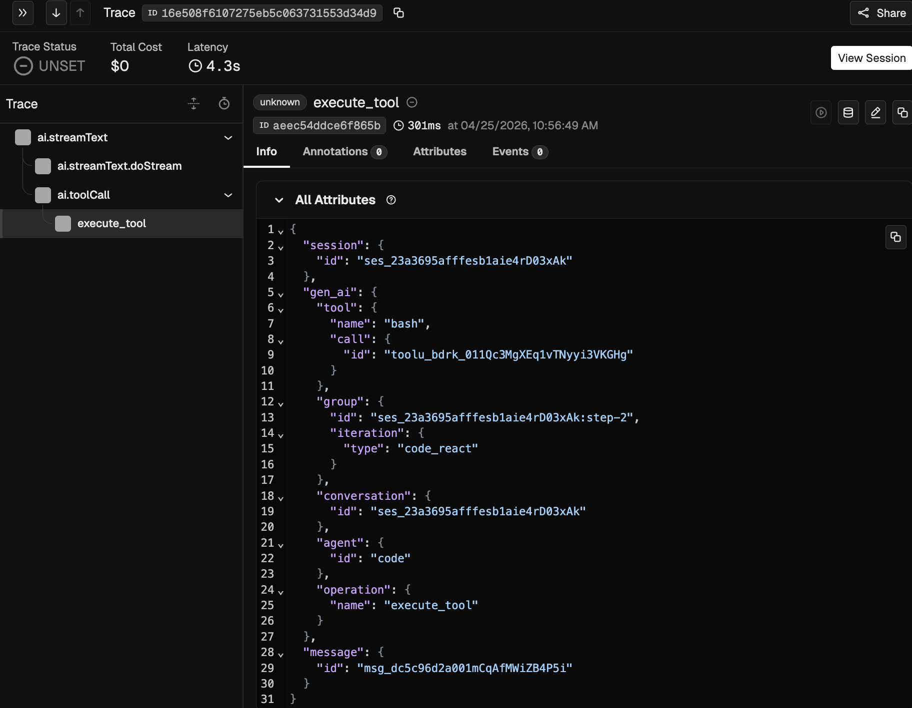

*Our `execute_tool` span. The matching `gen_ai.tool.call.id` proves the out-of-band carrier handoff worked. `gen_ai.operation.name: execute_tool` per the OTel GenAI semconv. `session.id` and `message.id` are Kilo-specific debug context.*

**step-3 (code agent, second bash tool round)**

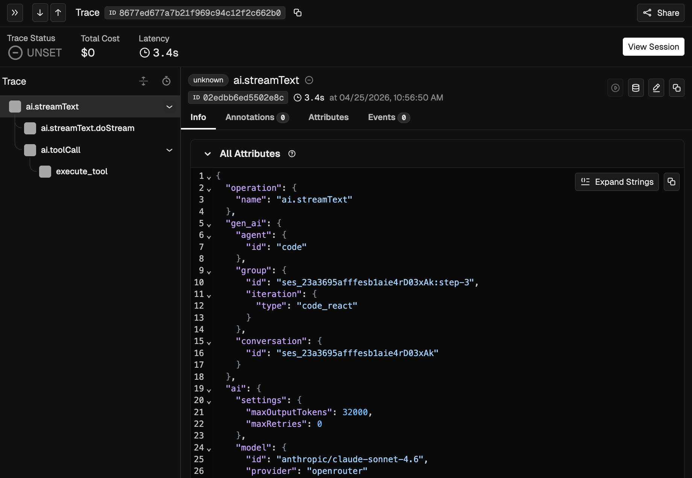

*Same shape as step-2 with `gen_ai.group.id: …:step-3`. Confirms the step counter increments per LLM round within the same conversation.*

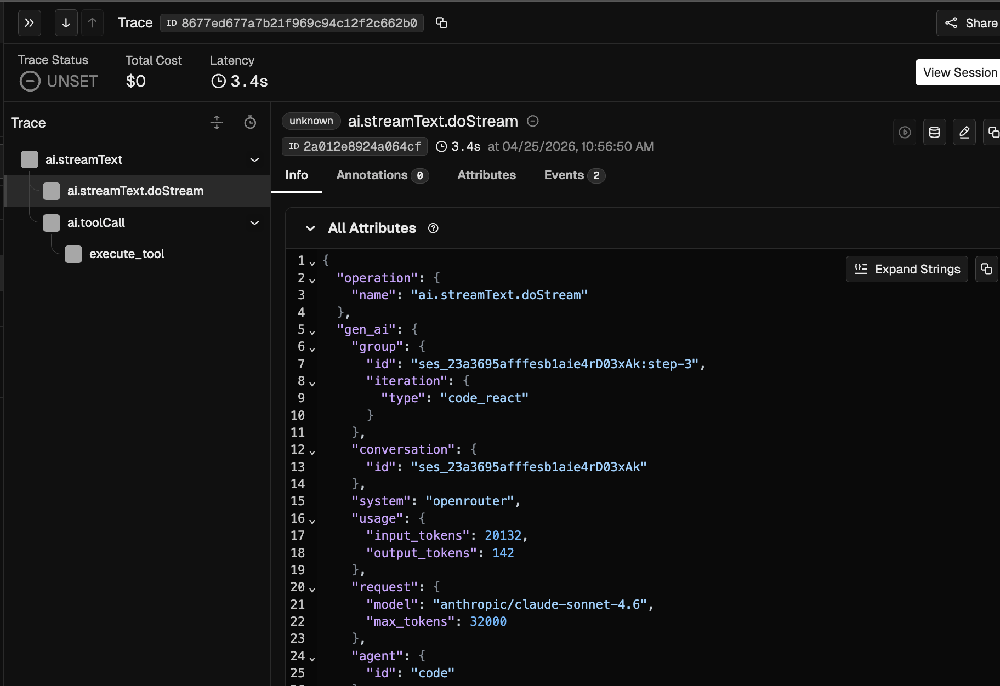

*`doStream` for step-3.*

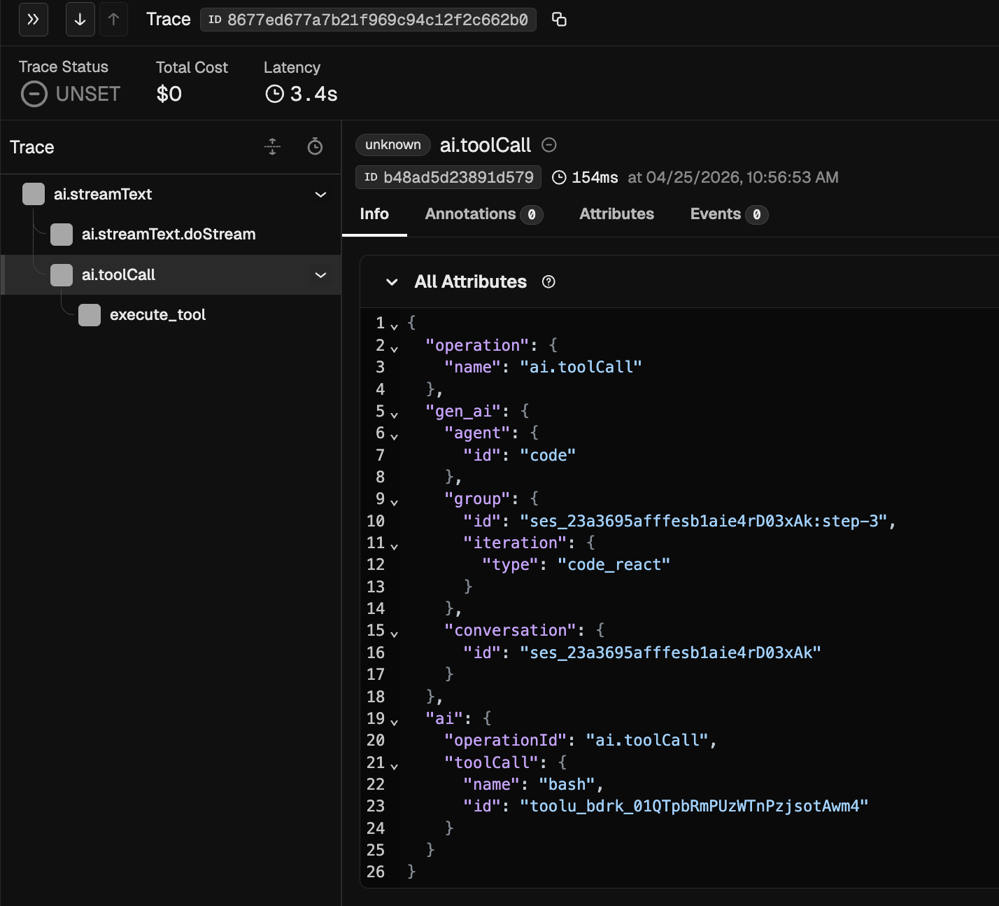

*Vercel `ai.toolCall` for step-3. New `tool_call.id: toolu_bdrk_01QTpbRmPUzWTnPzjsotAwm4`, distinct from step-2's id.*

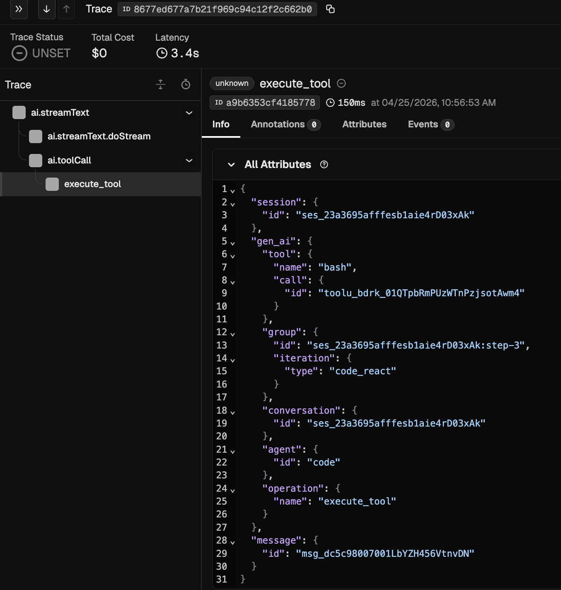

*Our `execute_tool` for step-3. Matching `tool.call.id` confirms the carrier map correctly distinguishes multiple tool calls within one session.*

**step-4 (code agent, final answer, no tool calls)**

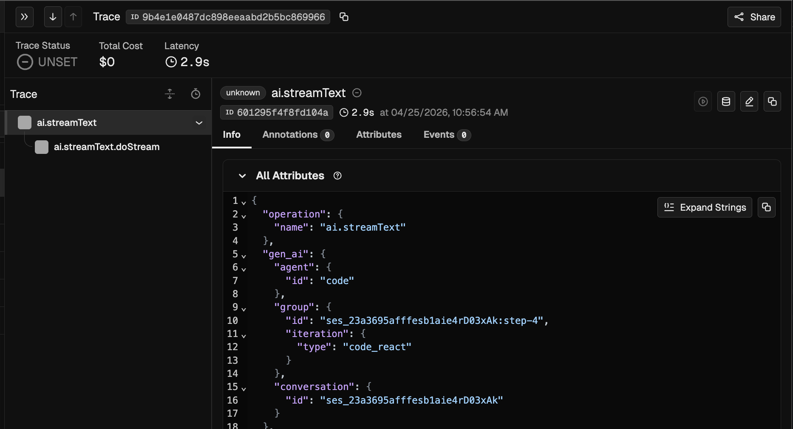

*Final LLM round. No tool calls, no `execute_tool`. Tree is just `ai.streamText` → `ai.streamText.doStream`. `group.id: …:step-4`.*

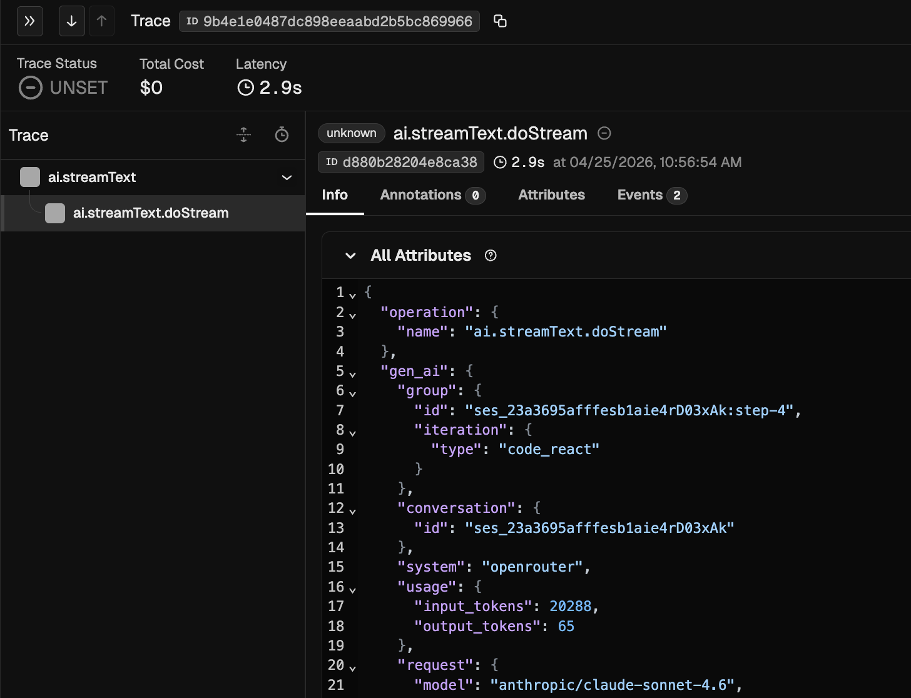

*`doStream` for step-4.*

What was confirmed working end-to-end:

- ✅ **Causality (#3662)**: every `execute_tool` span parented under
  Vercel's `ai.toolCall`, which is itself under `ai.streamText`. Each
  carries the unique `gen_ai.tool.call.id` matching the LLM's tool_call
  output.
- ✅ **Step-level grouping (#3661)**: `gen_ai.group.id` increments
  per LLM round (`step-1`, `step-2`, …) and is identical across all spans
  within one round.
- ✅ **Turn-level grouping (#3661)**: `gen_ai.conversation.id`,
  `gen_ai.agent.id`, `gen_ai.group.iteration.type` appear on every span
  via `BaggageSpanProcessor`.
- ✅ **OTel GenAI semconv-aligned attribute names** for all
  prototype-emitted attributes.
- ✅ **OTLP delivery** via `@opentelemetry/exporter-trace-otlp-proto`.
  PostHog flow unaffected.

Architectural surprises that the run surfaced (now reflected in the
Decisions table and commits 10a / 10b):

- **`@opentelemetry/exporter-trace-otlp-http` sends JSON; Phoenix's OTLP
  HTTP receiver only accepts protobuf** at `/v1/traces`. The JSON
  exporter was returning 415 Unsupported Media Type before any spans
  could land. Switched to the `-proto` package.
- **All Kilo production paths bypass commit 7's wrapper at
  `session/prompt.ts:1971`.** Extension, `kilo run`, and TUI all go
  SDK → server route handler → `svc.prompt(...)` directly, never
  through the exported `prompt()` function we wrapped. Baggage now
  lands at `LLM.run` immediately before `streamText({...})`, where
  every code path converges. Commit 7's wrapper stays as
  defense-in-depth for any future direct programmatic caller.
- **Each Vercel `ai.streamText` becomes its own trace** (root span),
  not a child of any Effect.fn ancestor, because `@effect/opentelemetry`'s
  separate provider only exports to OTLP via `OTEL_EXPORTER_OTLP_ENDPOINT`
  env var (and would also need its own switch to `-proto` to land in
  Phoenix). Multi-trace per turn is acceptable for the demo: causality
  is preserved within each trace, and grouping attributes link them
  across traces. Single-trace-per-turn would require either env-var
  setup + Effect-side proto fix, or an explicit kilo-telemetry-tracer
  parent span at the runPromise boundary. Neither is currently in
  scope.
- **The `title` agent shares the step counter** with the user's actual
  agent (both keyed by sessionID). In observed traces, `step-1` belonged
  to title generation and `step-2..N` to the code agent. Acceptable v0
  quirk; can be split per-agent later if needed.

## Implementation order (commit-by-commit)

Bottom-up sequencing. Each commit is reviewable in isolation and (commits 1
through 5) does not change user-visible behavior. Behavior changes start at
commit 7.

| # | Commit | Scope | Status | User-visible? |
|---|---|---|---|---|
| 1 | `docs: add OTel instrumentation plan` | This file | ✅ done | No |
| 2 | `test: validate OTel baggage propagation through Effect.gen and Effect.fn` | [packages/opencode/test/effect/otel-baggage-propagation.test.ts](packages/opencode/test/effect/otel-baggage-propagation.test.ts), 8/8 passing | ✅ done | No |
| 3 | `docs: update plan with validation results + dual-provider architecture` | This file | ✅ done | No |
| 4 | `feat(telemetry): add BaggageSpanProcessor to kilo-telemetry` | [packages/kilo-telemetry/src/tracer.ts](packages/kilo-telemetry/src/tracer.ts), filtered to `gen_ai.*` | ✅ done | No (no baggage set yet) |
| 5 | `feat(telemetry): add OTLP exporter to kilo-telemetry behind config flag` | kilo-telemetry adds OTLP as a second exporter alongside PostHog. Decisions made during this commit are captured in the Decisions table above (snake_case config shape, half-config tolerance, processor ordering). `record_content` lands in the schema but is not yet threaded to the Vercel AI SDK; that's commit 11. | ✅ done | No (default off) |
| 5a | `docs: capture OTLP config decisions and progress` | This file | ✅ done | No |
| 6 | `feat(telemetry): add CausalityCarrier module + withBaggage helper` | New `packages/kilo-telemetry/src/causality-carrier.ts` (pure OTel) and new `packages/opencode/src/effect/otel-baggage.ts` (Effect-aware helper with `<A, E>` signature; R = never). | ✅ done | No (not wired yet) |
| 7 | `feat(session): set turn-level baggage in SessionPrompt.prompt` | Wraps the external `prompt(input)` boundary at [`session/prompt.ts:1971`](packages/opencode/src/session/prompt.ts#L1971) with `context.with(setBaggage(...), () => runPromise(...))`. Adds inline `mapAgentToIterationType` and `buildTurnBaggage` helpers. Emits `gen_ai.conversation.id` always, plus `gen_ai.agent.id` and `gen_ai.group.iteration.type` when `input.agent` is provided. Avoids the R-limitation by setting baggage outside Effect; AsyncLocalStorage carries it through. Unit tests for the helpers. `loop` and `cancel` exports are not wrapped (out of scope for v0). | ✅ done | Yes (turn attributes appear on every span in the trace tree when `experimental.otlp_export.enabled=true`) |
| 7a | `docs: capture instrumentation roles and proposal alignment` | New "Instrumentation roles and proposal alignment" section in this file framing the dual-role we play in Kilo and mapping `processor.ts` capture to the #3662 out-of-band correlation pattern. | ✅ done | No |
| 8 | `feat(session): set step-level baggage in runLoop` | Originally planned at the runLoop while body. **Re-scoped to the LLM.run boundary** (commit 10b) where it piggybacks on the same site as turn-level baggage. Each `LLM.run` call increments a per-`sessionID` step counter and adds `gen_ai.group.id = "<sessionID>:step-<N>"` to the OTel baggage, alongside conversation/agent/iteration entries. All spans created by that LLM round (Vercel `ai.streamText`, `ai.streamText.doStream`, `ai.toolCall`, our `execute_tool`) inherit the same group.id via baggage propagation. | ✅ done (via 10b) | Yes |
| 9 | `feat(session): capture LLM/tool-call carrier in processor` | [`session/processor.ts` `case "tool-call":`](packages/opencode/src/session/processor.ts#L298). One-line `CausalityCarrier.capture(value.toolCallId, context.active())` plus imports. See "Instrumentation roles and proposal alignment" above for why this site (consumer) plays the role of "the instrumentor" from the #3662 out-of-band correlation pattern, analogous to how the Python prototype handles AutoGen, LlamaIndex, and CrewAI. | ✅ done | No (capture-only, not extracted yet) |
| 10 | `feat(tool): emit execute_tool span with causal parent` | [`tool/tool.ts` `Tool.wrap`](packages/opencode/src/tool/tool.ts#L78) replaces the existing `Effect.withSpan("Tool.execute")` with a span emitted via kilo-telemetry's tracer (so `BaggageSpanProcessor` copies turn-level baggage onto attributes). Parent context comes from `CausalityCarrier.extract(ctx.callID)` (commit 9 capture), falling back to `context.active()` when no carrier is captured. Attributes: `gen_ai.operation.name="execute_tool"`, `gen_ai.tool.name`, `gen_ai.tool.call.id` (when present), plus `session.id` and `message.id` (Kilo-specific debug). Span status set to ERROR with `Cause.pretty` message on Exit failure. | ✅ done | Yes — capstone; causality tree appears in OTLP traces |
| 10a | `fix(telemetry): switch OTLP trace exporter from -http (JSON) to -proto` | Empirically required: Phoenix and most OTLP receivers reject JSON at `/v1/traces` with 415 Unsupported Media Type. Switched [`kilo-telemetry/src/tracer.ts`](packages/kilo-telemetry/src/tracer.ts) import + added `@opentelemetry/exporter-trace-otlp-proto` dep. Same exporter API; protobuf wire encoding. | ✅ done | No (transport-level fix; was preventing v0 from working at all) |
| 10b | `feat(session): set turn + step baggage at streamText boundary in LLM.run` | Combined fix for commit 7 (turn) and commit 8 (step). Production paths bypass commit 7's wrapper at [`session/prompt.ts:1971`](packages/opencode/src/session/prompt.ts#L1971); LLM.run is the bottleneck where every code path converges before AI SDK calls. Sets `gen_ai.conversation.id`, `gen_ai.agent.id`, `gen_ai.group.iteration.type`, **and `gen_ai.group.id = "<sessionID>:step-<N>"`** in baggage immediately before `streamText({...})`. AsyncLocalStorage carries the OTel context through synchronous span creation and async event delivery; BaggageSpanProcessor copies entries onto every span. | ✅ done | Yes — turn + step attributes appear on every span in OTLP traces |
| 10c | (this commit) `docs: capture proto fix, LLM.run baggage site, and Phoenix validation results` | This file: Decisions table entries for the OTLP `-proto` switch and the LLM.run baggage site; implementation order updates marking 8 and 10 done with notes on the re-scoping; new "Validation against Phoenix (2026-04-25)" section capturing the empirical results. | ⏳ this commit | No |
| 11 | `feat(telemetry): thread record_content flag to Vercel AI SDK` | [`session/llm.ts`](packages/opencode/src/session/llm.ts) at the LLM.run boundary computes `recordContent = otlp_export.enabled && (record_content ?? true)` and passes it to `experimental_telemetry.recordInputs/recordOutputs`. When OTLP export is enabled, defaults ON so the user's backend sees full prompt/completion/tool content. PostHog's exporter strips content fields independently via `SENSITIVE_ATTRIBUTES` in [`kilo-telemetry/src/otel-exporter.ts`](packages/kilo-telemetry/src/otel-exporter.ts), so PostHog never sees content regardless of this flag. Validated against Phoenix on 2026-04-25: `ai.toolCall.args` and `ai.toolCall.result` populated when flag is true; absent when false. Note: Vercel AI SDK emits content under its own `ai.*` namespace, not the OTel GenAI `gen_ai.input.messages` / `gen_ai.output.messages` variants (Vercel's instrumentation choice, outside our control). | ✅ done | Yes (when `otlp_export.enabled=true` and `record_content` is unset or `true`) |
| 12 | `docs(telemetry): OTLP configuration recipe` | README in kilo-telemetry or top-level | pending | No |

## References

- Filed proposals
  - [#3661 Generic Grouping Attributes for Agentic Workflow Spans](https://github.com/open-telemetry/semantic-conventions/issues/3661)
  - [#3662 Causal Span Linking for LLM-Triggered Tool Execution](https://github.com/open-telemetry/semantic-conventions/issues/3662)
- Local working copies
  - `/Users/kam/development/OTEL/oss-contrib-prototypes/ISSUE_GROUPING.md`
  - `/Users/kam/development/OTEL/oss-contrib-prototypes/ISSUE_CAUSALITY.md`
- Python framework integration tests
  - [KazChe/otel-genai-semconv-grouping-causality-prototype](https://github.com/KazChe/otel-genai-semconv-grouping-causality-prototype)
- Existing Kilo telemetry foundation
  - [packages/kilo-telemetry/src/tracer.ts](packages/kilo-telemetry/src/tracer.ts)
  - [packages/kilo-telemetry/src/otel-exporter.ts](packages/kilo-telemetry/src/otel-exporter.ts)
- Key Kilo runtime files
  - Agent loop: [packages/opencode/src/session/prompt.ts](packages/opencode/src/session/prompt.ts) (`SessionPrompt.run` at L1340)
  - Stream event handling: [packages/opencode/src/session/processor.ts](packages/opencode/src/session/processor.ts) (`case "tool-call":` at L298)
  - LLM call site: [packages/opencode/src/session/llm.ts](packages/opencode/src/session/llm.ts) (`streamText` at L338)
  - Tool wrap: [packages/opencode/src/tool/tool.ts](packages/opencode/src/tool/tool.ts) (`Tool.wrap` at L83)
